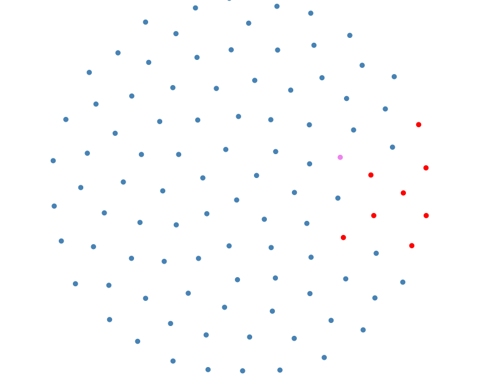
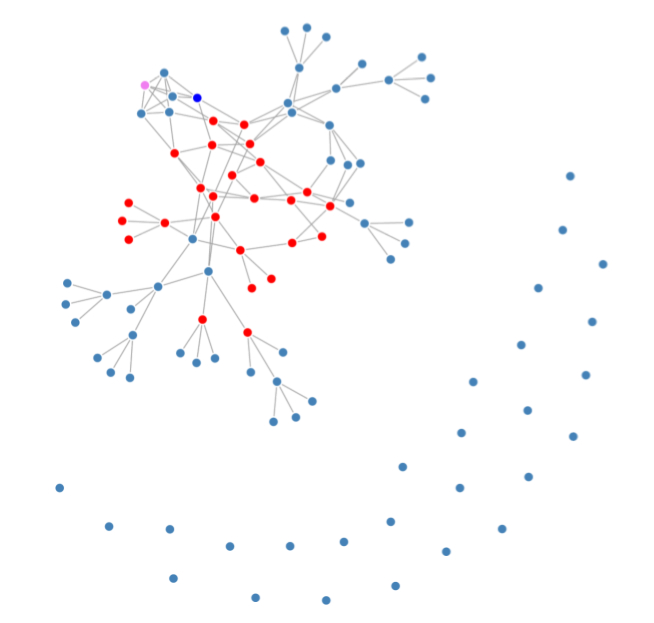
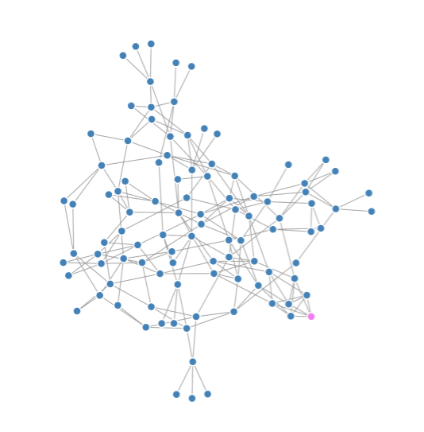

# nodejs_gossip
nodejs gossip protocol implementation

<b>nodejs gossip.js<b/>  
connect to localhost:8080 in chrome browser to processes

console commands:
reset
reset <peer>
color <css_color>

NODES to build a network

network broken example

rebuilded network

